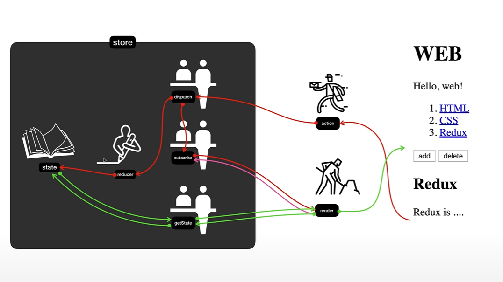

# redux-study
<br>

# 생활코딩-redux

## HTML, CSS와 Redux 만으로 간단한 어플리케이션 만들기

<br>

### Redux 개념 학습



<br>

1. store에는 정보가 저장됨

  * state : 실제 정보가 저장됨(절대로 직접 접속 X)
  * reducer : 현재 상태를 변화시킬 함수
  * dispatch : 전송된 action에 반응 -> reducer를 호출해 state를 변경 / subscribe를 호출해 render 호출
  * subscribe : state가 변동될 때마다 render 함수 호출
  * getState : store의 값을 가져올 수 있게 함

<br>

2. store 밖의 구성 요소
  * render : UI를 만들어주는 코드
  * action : 객체를 전송

<br>

### Dispatch의 동작 구조

1. dispatch가 reducer를 호출할 때 2개의 값을 전달
  
  * 현재의 state 값
  * action data
  * reducer은 state값을 입력 받고 action을 참조하여 새로운 state 값을 return (state 가공)

<br>

2. state값이 변경되면 dispatch render 호출
  * subscribe에 등록되어 있는 모든 구독자들을 호출
  * 각 구독자마다 render 시행

<br>

### Redux가 좋은 이유

1. 상호작용이 많은 컴포넌트의 수가 늘어날 수록 Redux 없이 코드를 관리하기 어려움
2. 변경된 상태를 기록하여 과거의 상태를 참조할 수 있음

<br>

---

<br>

# Inflean 따라하는 리액트 A-Z : 리덕스

## TSX와 Redux를 활용한 간단한 카운터 앱 만들기

<br>

### reducer

```typescript
// src/reducer/index.tsx

const counter = (state=0, action: {type:string}) => {
  switch (action.type) {
    case 'INCREMENT':
      return state+1
    case 'DECREMENT':
      return state-1
    default:
      return state
  }
}

export default counter;
```

### createStore()

```typescript
// src/index.tsx

import counter from './reducer';
import { createStore } from 'redux';

const store = createStore(counter)
```

### getStore()

```typescript
// src/index.tsx

<App
  value={store.getState()}
  onIncrement={() => store.dispatch({type:'INCREMENT'})}
  onDecrement={() => store.dispatch({type:'DECREMENT'})}
/>
```

### subscribe()

```typescript
// src/index.tsx

const render = () => root.render(
  ...
);
render();

store.subscribe(render);
```

### App.tsx

```typescript
// src/App.tsx

type Props = {
  value: number;
  onIncrement: () => void;
  onDecrement: () => void;
}

function App({value, onIncrement, onDecrement}: Props) {
  return (
    <div className="App">
      Clicked: {value} times
      <button onClick={onIncrement}>
        +
      </button>
      <button onClick={onDecrement}>
        -
      </button>
    </div>
  );
}

export default App;
```

---

## combineReducer(Counter + Todo)

<br>

### rootReducer 생성

```tsx
// src/reducer/index.tsx

import { combineReducers } from "redux";
import counter from "./counter";
import todos from "./todos";

const rootReducer = combineReducers({
  counter,
  todos
})

export default rootReducer;
```

```tsx
// src/reducer/todos.tsx

enum ActionType {
  ADD_TODO = 'ADD_TODO',
  DELETE_TODO = 'DELETE_TODO'
}

interface Action {
  type: ActionType;
  text: string
}

const todos = (state=[], action: Action) => {
  switch (action.type) {
    case 'ADD_TODO':
      return [...state, action.text]
    default:
      return state
  }
}

export default todos;
```

```tsx
// src/index.tsx

import rootReducer from './reducer';

const store = createStore(rootReducer)
```

---

## provider

react-redux 라이브러리 활용

```tsx
// src/index.tsx

import { Provider } from 'react-redux';

const store = createStore(rootReducer)

const render = () => root.render(
  <React.StrictMode>
    <Provider store={store}>
      <App
        ...
      />
    </Provider>
  </React.StrictMode>
);
render();
```

---

## useSelector, useDispatch

리덕스의 Hooks 역할

### useSelector : store의 값을 가져올 수 있음

```tsx
// src/reducer/index.tsx에 RootState 타입 생성

export type RootState = ReturnType<typeof rootReducer>

// 생성한 RootState를 src/App.tsx의 state 객체에 제공

const counter = useSelector((state: RootState) => state.counter);
const todos: string[] = useSelector((state: RootState) => state.todos);


```

### useDispatch : store에 있는 dispatch 함수에 접근할 수 있음

```tsx
// src/App.tsx

function App({value, onIncrement, onDecrement}: Props) {
  const dispatch = useDispatch();
  ...

  dispatch({ type: "ADD_TODO", text: todoValue })
  ...
```

---

## redux middleware

* 리덕스 미들웨어는 액션을 dispatch 전달하고 reducer에 도달하는 순간 사이에 사전에 지정된 작업을 실행할 수 있게 해주는 중간자 역할

* 로깅, 충돌보고, 비동기API와의 통신, 라우팅 등을 위해 사용

### redux login middleware 생성

```tsx
// src/index.tsx
const loggerMiddleware = (store: any) => (next: any) => (action: any) => {
  console.log("store", store);
  console.log("action", action)
  next(action);
}

const middleware = applyMiddleware(loggerMiddleware);
const store = createStore(rootReducer, middleware);
```

### redux thunk

리덕스를 사용하는 앱에서 비동기 작업을 할 때 많이 사용하는 방식

```tsx
// src/reducer/posts.tsx

enum ActionType {
  FETCH_POSTS = 'FETCH_POSTS',
  DELETE_POSTS = 'DELETE_POSTS'
}

interface Post {
  userId: number;
  id: number;
  titile: string;
}

interface Action {
  type: ActionType;
  payload: Post[]
}

const posts = (state=[], action: Action) => {
  switch (action.type) {
    case 'FETCH_POSTS':
      return [...state, ...action.payload]
    default:
      return state
  }
}

export default posts;
```

```tsx
// src/App.tsx

...
useEffect(() => {
  dispatch(fetchPosts())
}, [dispatch])

const fetchPosts = ():any => {
  return async function fetchPostsThunk(dispatch:any, getState:any) {
    const response = await axios.get('https://jsonplaceholder.typicode.com/posts');
    dispatch({type: "FETCH_POSTS", payload: response.data})
  }
}
...

```

actions는 객체여야하는데, 함수를 dispatch 하면 에러가 남.
함수를 dispatch 할 수 있게 해주는 redux-thunk 미들웨어 설치해 사용.

```bash
$ npm install redux-thunk
```

```tsx
// src/index.tsx

import thunk from 'redux-thunk'

const middleware = applyMiddleware(thunk, loggerMiddleware);
```

```tsx
// src/actions/posts.tsx


export const fetchPosts = ():any => async(dispatch: any, getState: any) => {
  const response = await axios.get('https://jsonplaceholder.typicode.com/posts');
  dispatch({type: "FETCH_POSTS", payload: response.data})
}
```